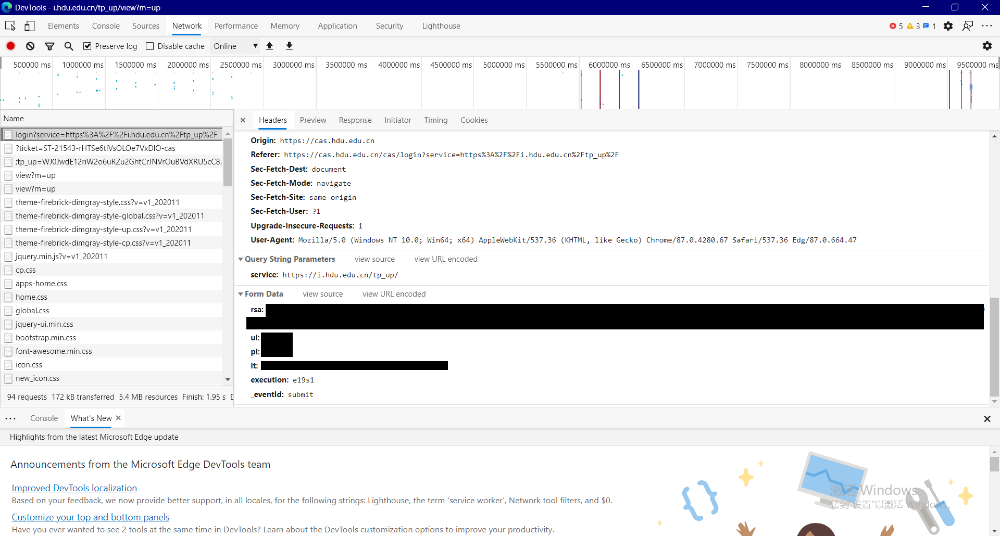
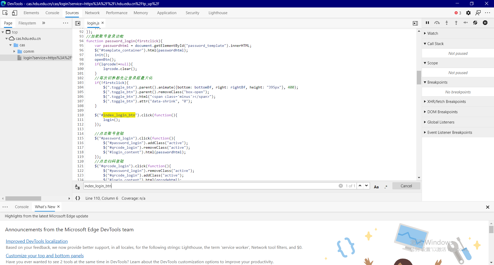
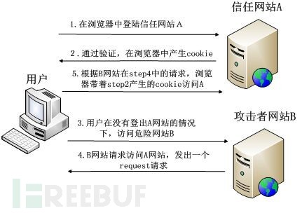
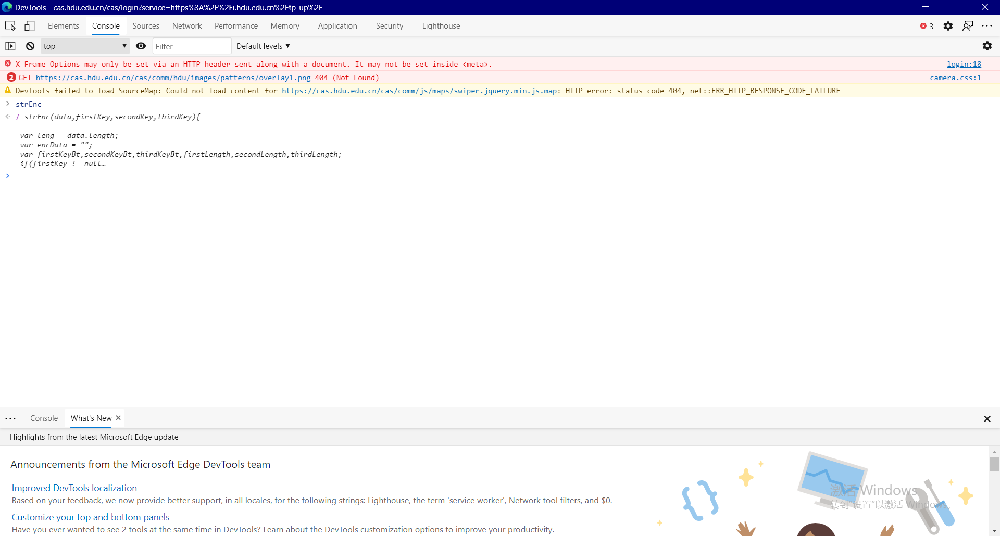
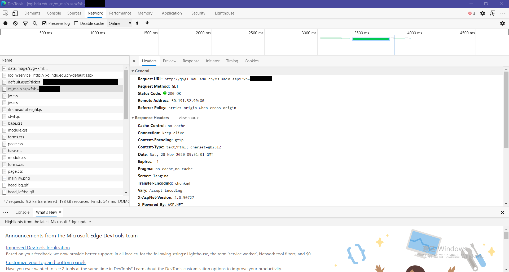
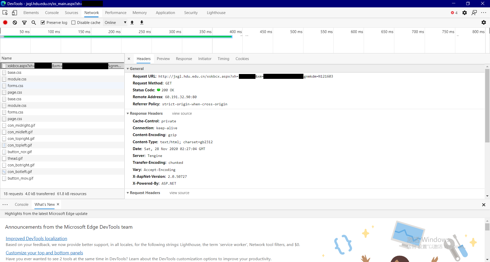
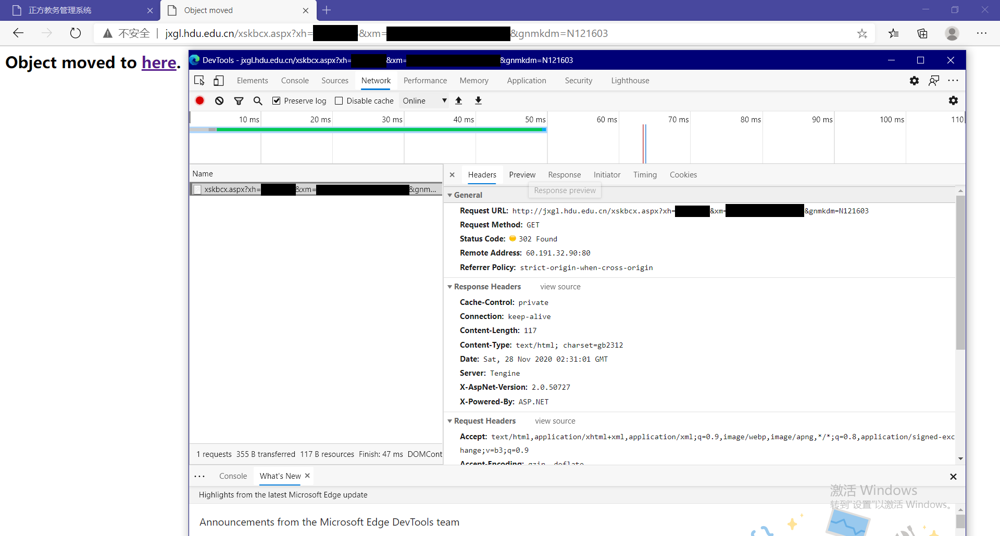

# 爬虫——从喊NB到获取自己的课表

爬虫（Spider）这个词相信大家都听说过，从网页搜索引擎，饭圈刷数据，到秒杀Any抢不到的格裙，都是爬虫的具体实现

这个概念一听就很nb，但是今天我通过这篇文章来让大家大致对它有个认识，甚至能自己实现一个基础的爬虫


硬广：学习Go后端开发哪家强，就来杭电找助手，学长指导，带你快速入门后端开发，自动部署，积累项目经验，处理十w级数据，在外面学习这样的技能是需要交w级学费的哦

### 需求

Any是一只老鸽子，他经常忘记自己的早课是在哪个教室，以及水课的时间，所以他经常需要在教学楼门口打开钉钉，查看杭电助手给他提供的课表

 杭州的天气冷的就是这么突然，Any站在寒风中瑟瑟发抖的等待着钉钉和学校鉴权接口的响应，他想，要是能跳过这些步骤，直接拿到最新的课表就好了，还可以自动设置提醒事项（这是他唯一不太会咕咕的途径）

想了一下，Any准备用Go来实现，因为Go不仅是杭电助手的后端语言，而且易于跨平台（可以编译成so库）在他的的手机上运行

正常来讲，获取自己的课表需要两步

1. 登录杭电的统一CAS

2. 访问教务系统，拿到课表


PS：会Go还有个好处，见人就可以说自己会**云原生**

## 前置要求

因为是后端出的文章，阅读前，我默认你有以下基础

1. 知道一点HTTP，比方说什么是GET什么是POST，Cookies

2. 看得懂基础的HTML和JavaScript（以下简称js）

3. 发过HTTP请求（这篇文章用的是Go），比如说请求过API，这个没有也没关系，这篇文章里有

其实没有基础也没关系，**文章末尾会给完整代码**，Go语言的好处就是编译方便，编译完了直接调就行

什么？你还没配置好Go编译环境？请按照去年的推文配置

## 杭电统一CAS

众所周知，杭电的服务在使用前大多都需要进行登录，负责登录的就是所谓的`HDU统一身份认证系统`，即`CAS`，进入正方教育系统爬取课表的时候也是一样，我们需要先过杭电的统一CAS（以下为了方便，简称CAS）

模拟请求，首先要知道这个页面发送了什么请求，我们一般使用的是F12的Network工具，一般浏览器里分析都用这个，因为不用安装根证书就可以获取到HTTPS流量

### F12和对应的反爬

但是，有些网站为了反爬，会通过js设置一个限制，禁止F12（之前CAS也有，但最近好像取消了）

去年的推文（用F12的那篇），没有考虑网页禁止打开F12防止分析的情况，今天顺便说一下，如果遇到这种网页，应该怎么打开F12

方法很简单，我们从实现入手，一般来说，网页会通过这样一段js来实现：

```javascript
//禁止F12键盘事件
document.addEventListener('keydown', function(event){
   return 123 != event.keyCode || (event.returnValue = false)
});
//禁止右键、选择、复制
document.addEventListener(‘'contextmenu'’, function(event){
   return event.returnValue = false
})
```

假设你和我一样，不会写js，一般OOP的思想也能让你注意到，这里添加`EventListener`的作用域是`document`，而键盘事件通常需要对应的`EventListener`获得**输入焦点**，所以绕过思路也很简单，让这个`document`失去焦点即可，一般操作是点一下浏览器的地址栏再按F12

### HTTP 请求

Go发送请求有原生库`net/http`，但是对于爬取数据很不方便，这里介绍一个通常使用的框架`GoRequest`，简化了添加Header，Cookies缓存等等一系列流程，我说起来可能不太清楚，举个例子，也是`GoRequest`作者介绍它的第一句话：`GoRequest是由Python下requests库启发的`

`requests`库相信大家都熟，老爬虫必备了

分析CAS的Header，很容易看出它是由ASP.NET实现的

ASP.NET后端的网站（称ASP.NET后端可能有点不合适，因为当年巨硬生态闭环的战（ye）略（xin），它实际包含了前端实现，之后我们会讲到）POST请求中，`Body`一般是一个表单(Form)，我们看一下怎么用GoRequest以POST方式发送一个表单

```go
var request=gorequest.New()
var url="http://cas.hdu.edu.cn/cas/login?service=https%3A%2F%2Fi.hdu.edu.cn%2Ftp_up%2F"
request.Post(url).Type("form")
resp,body,errs= request.Send(map[string]interface{}{
		"rsa":rsaValue,
    	"ul":len(unValue),
    	"pl":len(pdValue),
		"lt":ltValue, //CSRF
		"execution":execValue,
		"_eventId":"submit",
}).End()
```

这一切都很“直觉”，发Get请求呢？更直觉

```go
resp,body,errs:= request.Get(url).End()
```

HTTP状态码对应`resp.StatusCode` ，响应的`Body`包含在第二个返回值中

### 模拟登录CAS

你可能会觉得有点快：怎么这么快就到CAS登录了？但其实爬虫听起来很高端（其中有些逆向分析技术也确实很高端），但原理上来讲，它做的是模拟发一些HTTP请求，这里我会一步步分析，之后的教务系统部分我会省略这里已经提到的内容

#### F12-Network

现在用之前提到的F12-Network来分析CAS的登录请求

具体步骤：切换到Network选项卡，勾选`Preserve log`（这很重要，能在发生302等跳转时保留之前的流量记录）

填入你的账号和密码，点击登录，你应该会看到下面这个请求



在这张图里，我们可以找到调用接口所需的几乎所有信息：

1. URL：`https://cas.hdu.edu.cn/cas/login?service=https%3A%2F%2Fi.hdu.edu.cn%2Ftp_up%2F`（service参数后面是UrlEncode后的跳转地址，为了方便，这里使用的是[智慧杭电](https://i.hdu.edu.cn)）
2. 请求方式（Method）：POST
3. Content-Type：`application/x-www-form-urlencoded`（对应GoRequest里的`request.Type("form")`）
4. 表单参数
5. 响应码（StatusCode）：302（Go的`http.Client`会帮我们跟进Redirect，具体代码在`http.Client.Do()`函数里，这里考虑到难度，不跟进分析了，其实就是个递归GET，不难理解）

前三个比较固定，没什么好说的，照着填就行，最关键的是这里面的表单参数，对于它们的含义，我们接下来分析

#### 表单参数的解析

**注意：本模块具体内容不保证时效性**

在登录按钮上点击右键，选择`检查`（Firefox一般称为`审查元素`），在Elements选项卡下，会定位到如下元素：

```html
<a class="landing_btn_bg" id="index_login_btn"> 登&nbsp;&nbsp;录 </a>
```

一般来说，如果有静态绑定的`点击`事件，这里的标签内通常会包含`href`或者`onclick`（通常，对于这种提交表单的按钮，`onclick`更常见一些），很显然，这里没有，说明事件处理函数是动态绑定的，这就要求我们去js里找

为了查找js中的代码，我们引入F12-Sources选项卡，经过一番查找，我们找到了`https://cas.hdu.edu.cn/cas/comm/hdu/js/login.js`这个文件，在其中全文查找`登录`按钮的id，如下图：



这里，注册了`登录`按钮的`click`事件，跟进实际处理函数`login()`，可以看到实际发送登录请求的代码（为了方便理解，我加了注释）

```javascript
function login(){
	var $u = $("#un") , $p=$("#pd"); //通过$("#[id]")来获取用户输入
	//前端检查账号和密码是否为""，js对空的解释很有意思
	var u = $u.val().trim();
	if(u==""){
		$u.focus();
		$u.parent().addClass("login_error_border");
		return ;
	}
	
	var p = $p.val().trim();
	if(p==""){
		$p.focus();
		$p.parent().addClass("login_error_border");
		return ;
	}
	
	$u.attr("disabled","disabled");
	$p.attr("disabled","disabled");
	//从这里开始组装表单
	var lt = $("#lt").val(); //这里就是一个典型的识别性token，兼有CSRF的作用，接下来会讲什么是CSRF
	
	$("#ul").val(u.length); //ul参数的含义就很明确了，账号的长度
	$("#pl").val(p.length); //同理，pl参数的含义就是密码长度
	$("#rsa").val(strEnc(u+p+lt , '1' , '2' , '3')); //这里有一个未知的函数strEnc，我们要去找它的实现
	
	$("#loginForm")[0].submit(); //通过submit()函数POST提交表单
	
}
```

在表单中，`ul`和`pl`这两个参数含义比较明确，我们需要重点关注的是`lt`和`rsa`这两个字段

#### CSRF

表单中有一个`lt`参数，而我们在js中找不到填充它的实现，清除缓存后的值也不同，说明这是由后端根据Session返回的，在F12-Elements中可以看到

```html
<input type="hidden" id="lt" name="lt" value="[...]">
```

其中被`value`包裹的就是`lt`参数的值，它客观上起到了一个防CSRF的作用

**CSRF**：跨站点请求伪造（Cross Site Request Forgery），可以理解为一种凭据窃取

拿CAS举例，你访问了一个恶意网站（通常伪装成什么学生任务，大家也见得多了），那么通常的CSRF流程是这样的

1. 那个网站先跳转到CAS（当然，CAS页面本身是合法的，不是假冒的钓鱼网站）

登录成功后，浏览器中就有了CAS返回的Cookies，当然，CAS设置的Cookies是仅限`hdu.edu.cn`后缀的网站可见的

2. 恶意网站发送对`hdu.edu.cn`后缀网站的其它请求，比如读取你的个人信息

3. 浏览器发现这个请求URL的后缀符合`hdu.edu.cn`，于是带上了CAS的Cookies一起发送

4. 请求到达目的服务器后端，目的服务器根据Cookies得到Session（假设Session合法且没有过期），执行操作

一般的CSRF攻击（狭义上的）的流程大致是这样的（图片来源[CSRF简介 - FreeBuf网络安全行业门户](https://www.freebuf.com/column/186939.html)）：



当CAS加上了这个防CSRF的字段（以下说明部分称为`token`），并在后端与Cookies对应的Session绑定后，到第2步恶意网站拼接请求的时候，是得不到这个`token`的（一般来说，网页不能得知跳转到不同Cookies Domain网页中的内容）

那么在第四步，后端验证请求合法性时，会因为没有提供`token`而鉴权失败，不会执行接口对应的操作

当然，这是最基本的，CSRF还能结合`<iframe>`标签，`xss`，`css注入`等一系列操作，这里就不介绍了，毕竟是后端文章不是安全文章

#### 获取参数`lt`

理论的东西讲完了，对我们的模拟登录来说，怎么获取到`lt`参数的值才是关键

非.NET CORE时代的ASP.NET（以下简称老ASP.NET）前后端并没有严格分离，所以典型的实现并不会单独实现一个接口，根据Session来返回一个CSRF Token，而是直接像jsp一样先使用一个占位符，在请求到达后端，渲染页面时动态填充，返回给前端

```html
<input type="hidden" id="lt" name="lt" value="[...]">
```

在这种情况下，我们要做的就是先像浏览器中的访问一样，先发送一个GET请求

```go
var url="http://cas.hdu.edu.cn/cas/login?service=https%3A%2F%2Fi.hdu.edu.cn%2Ftp_up%2F"
resp,body,errs:= request.Get(url).End()
```

在`body`中，我们拿到了这个一个HTML，很快就能定位到`lt`所在的`<input>`标签，我们的目的是拿到其中`value`包裹的部分

提取非js动态渲染的html标签中的值一般有两种方法

1. 解析HTML（XPath）

2. 正则表达式

考虑到Go本身自带`regexp`正则表达式库，并且根据XPath选取HTML元素的库[libxml2](github.com/lestrrat-*go*/libxml2)有坑，这里直接使用正则表达式提取`lt`参数值`value`

正则表达式网上一般都是实例偏多，教程偏少，从我自己的经验来看，入门还是有点困难的，我是在学长的指点下才学会最基本的使用，这里我直接给出代码，并结合注释进行说明

```go
func getLTValue(body string) (string,error) {
    //注意：这里末尾没有限制引号的匹配次数，因为value属性后面没有更多的引号了
	var lineExpr = regexp.MustCompile("<input type=\"hidden\" id=\"lt\" name=\"lt\" value=\".+\" />")
	var ltLine = lineExpr.FindString(body) //选取lt参数所在的行
	if ltLine == "" {
		return "", errors.New("fail to find lt line")
	}
	fmt.Printf("lt line:%s\n", ltLine)
	return getValue(ltLine)
}

func getValue(line string) (string,error){
    //匹配：value="[...]"
	var valuePair = regexp.MustCompile("value=\".+\"").FindString(line) //不做检查，因为已经符合line表达式
    //替换：去除"value="和"\""
	var value = regexp.MustCompile("(value=)|(\")").ReplaceAllString(valuePair, "")
	fmt.Printf("value:%s\n",value)
	return value, nil
}
```
表单中还有一个名为`execution`参数，也需要用类似的方法获取，只是`lineExpr`需要做一些改动。就不再重复贴代码了。也算是一个思考题

#### JS模拟执行

接下来是`rsa`参数的解析，现在我们在审（xia）阅（cai）中遇到了一个明显不是库函数的`strEnc`，需要找它的实现，这里介绍一个很方便的方法：F12-Console

F12-Console可以近似认为是一个控制台，我更倾向于认为它是一个带网页上下文的js解释器

由于js函数能作为变量被读取和修改（实际上不是什么特性，函数本质是是可以执行的数据），我们可以直接在Console中输入函数的名称（如果在当前作用域下的话，一般会自动补全）+回车来输出它的定义和实现



点击函数体，我们回到了Sources选项卡，`strEnc`的实现在`https://cas.hdu.edu.cn/cas/comm/js/des.js`中，代码如下（懒得看可以直接跳过，接下来提供一个小技巧来直接调用它）

```javascript
function strEnc(data,firstKey,secondKey,thirdKey){  
    //代码很长，省略不看
}
```

这么长的代码，对于像我这样不会js的人来说，明显是不可能去分析的（把这段代码转换成Go理论上没什么问题，但会消耗很多时间）

观察这个`des.js`，我们发现它好像是一个工具类，没有依赖于其它js，这种情况下，我们就可以使用`模拟执行`大法了

像Go和Python这些语言一个很大优点就是生态还可以（说人话就是库很多）

本来都想上`headless browser`了，结果网上一搜找到了一个go写的js解释器：[Otto](github.com/robertkrimen/otto)，安装方法很简单，在当前项目目录下运行命令

```shell
$ go get -v github.com/robertkrimen/otto/otto
```

在模拟执行`des.js`使用也很简单，我直接贴代码并加上必要的注释

```go
// 获取表单中rsa参数的值，userName是账号，password是密码，ltValue是表单中的lt参数
func GetRSAValue(userName string,password string,ltValue string) string{
	rawJs, err := ioutil.ReadFile("des.js") //读入本地的des.js
	if err != nil {
		panic(err)
	}

	vm := otto.New() //初始化一个JS虚拟机

	_, err = vm.Run(string(rawJs)) //执行js中的初始化函数（比如全局变量赋值，字符串解密）
	if err!=nil {
		panic(err)
	}
	//下面两行就是strEnc(u+p+lt , '1' , '2' , '3')
	var inputStr=userName+password+ltValue
	value, err := vm.Call("strEnc", nil, inputStr , "1" , "2" , "3")
	if err != nil {
		panic(err)
	}
	var result=value.String() //将结果填充到一个go string对象
	fmt.Println(result)
	return result
}
```

到这里，我们就可以拿到`rsa`参数的值了，也完成了表单参数的解析，可以发送请求了

#### 发送请求

在发送请求之前，还有一个小细节，`User-Agent`，UA是什么我就不多做解释了，你可以把它抽象的理解为一个HTTP Header

实验证明，如果不带`User-Agent`头向CAS发送请求（不像Python的`requests`，`GoRequest`的默认实例不带`User-Agent`头），会直接Timeout，这是一种常见的反爬措施

在`GoRequest`中添加请求头很简单

```go
var request= gorequest.New()
request.DoNotClearSuperAgent=true //这里表示在一次请求完成后不清空Header等请求参数，这样就可以只Add一次
request.Header.Add("User-Agent",USER_AGENT) //USER_AGENT是一个常量，复制你自己在F12-Network中看到的值即可
```

注意，不论网站有没有做UA反爬，最好还是带上UA提交，毕竟运维看到一大堆明显是异常的UA的时候肯定会采取行动

之后的步骤就和`HTTP 请求`部分中提到的一样，POST我们组装好的表单

```go
ltValue,err:= getLTValue(body) //获取lt参数值
if err!=nil{
	panic(err)
}
execValue,err:=getExecutionValue(body) //获取execution参数值
if err!=nil{
	panic(err)
}
var unValue=CAS_USER_NAME //CAS_USER_NAME是你的CAS账号
var pdValue=CAS_PASSWORD //CAS_PASSWORD是你的CAS密码
var rsaValue= GetRSAValue(unValue,pdValue,ltValue)
//组装并发送请求
request.Post(url).Type("form")
resp,body,errs= request.Send(map[string]interface{}{
	"rsa":rsaValue,
	"ul":len(unValue),
	"pl":len(pdValue),
	"lt":ltValue,
	"execution":execValue,
	"_eventId":"submit",
}).End()
```

之后，就像浏览器中发生的那样，`http`库自动跟进了302跳转（中间有一个根据`lt`获取`ticket`的过程），最终把我们带到了智慧杭电页面，完成CAS模拟登录的流程

## 获取自己的课表

大家都选过课了，应该知道杭电像很多其它大学一样，用的是正方的教务系统，不同的是 ，杭电通过CAS替换了位于`default2.aspx`中的登录流程，而我们已经进行过CAS登录了，可以直接访问教务系统的主页

### 和在浏览器中访问的区别

在浏览器中访问教务系统（在智慧杭电中叫做`选课系统`），我们最终看到的URL是`http://jxgl.hdu.edu.cn/xs_main.aspx?xh=[学号]`，但是我们如果在F12-Network中跟踪整个过程，就会发现事情没有那么简单



实际上，它包含了3个步骤

1. 访问`http://jxgl.hdu.edu.cn/default.aspx`，拿到一个带有`ticket`（和CAS中拿到的`lt`不同）的POST表单

2. 通过GET请求后端"verify"这个`ticket`，并返回一个跳转到主页的`<script>`标签

```html
<script language='javascript'>window.open('xs_main.aspx?xh=[学号]','_self','');</script>
```

这里涉及到一个ASP.NET网站常用的技巧`Postback`，为了降低难度，就不仔细分析它的机制了（类似`ajax`），我们只需要了解它做了什么：POST提交了一个表单，表单参数正常地位于`<form>`标签内即可，但是，它对爬虫来说有个坑，接下来会说

3. 执行返回页面中的`<script>`标签，跳转到`http://jxgl.hdu.edu.cn/xs_main.aspx?xh=[学号]`，也就是我们在浏览器中最终看到的URL

### 访问教务系统主页

对于模拟请求来说，我们需要做的就是先GET请求`http://jxgl.hdu.edu.cn/default.aspx`，然后再访问`http://jxgl.hdu.edu.cn/xs_main.aspx?xh=[学号]`

```go
//获取ticket
var jwUrl=fmt.Sprintf("http://jxgl.hdu.edu.cn/default.aspx")
resp,body,errs=request.Get(jwUrl).End()
if errs!=nil{
	panic(errs[0])
}
fmt.Println(resp.StatusCode)
err= ioutil.WriteFile("resp_ticket.html", []byte(body),0644)
if err!=nil{
	panic(err)
}
//访问主页
var mainPageUrl =fmt.Sprintf("http://jxgl.hdu.edu.cn/xs_main.aspx?xh=%s",unValue)
resp,body,errs= request.Get(mainPageUrl).End()
if errs!=nil{
	panic(errs[0])
}
fmt.Println(resp.StatusCode)
err= ioutil.WriteFile("main_page.html", []byte(body),0644)
if err!=nil{
	panic(err)
}
```

不直接请求课程表接口的原因是因为老ASP.NET的页面是有状态的（用`base64`编码了页面上控件的一些属性），通过`Postback`机制与后端交互，而后端的逻辑对我们来说显然是不可见的，所以为了保险起见，我们按照浏览器的流程走一遍

### 请求课程表

和CAS的步骤一样，我们先分析这个接口的URL，请求方式，有哪些参数



1. URL：`http://jxgl.hdu.edu.cn/xskbcx.aspx?xh=[学号]&xm=[姓名的GBK+UrlEncode编码]&gnmkdm=N121603`

2. 请求方式：GET

3. 参数：包含在URL中，其中`姓名的GBK+UrlEncode编码`不想自己生成可以直接照抄

这里其实有一个坑，表面上响应头中`Content-Type`指定了编码`charset=gb2312`，实际上，`xm`参数的编码是GBK

#### `Postback`机制的坑

正方的教务系统有一个比较奇妙的地方：就算是在浏览器里（已经登录的情况下），你直接重发它的功能接口也不能得到正确的返回，而是会获得一个`Object moved to here`的页面



这就是典型的使用`Postback`机制做动态网页的网站的坑，由于`Postback`可以返回一整个`Form`（ASP.NET的概念），所以会使用302跳转，按照约定，302跳转的目的URL时响应Header中的`Location`

但老ASP.NET拼接`Location`的时候，伪代码是这样的：`"./"+返回的Form在站点中的相对路径`（可以在F12-Elements中看到`here`这个超链接的目的地址就是`.`）

但是不论是浏览器还是`GoRequest`的GET请求默认都是不会带`Referer`头的，于是浏览器不知道这个表示当前站点的`.`是什么，拿不到`Location`头，无法完成跳转（`Object moved to here`实际上是浏览器报的错）

解决方法也很简单，在请求教务系统的功能接口时，自己加上`Referer`头

```go
//正方教务系统的坑，必须加Referer头：https://blog.csdn.net/qiangrenpu8881/article/details/82260774
request.Header.Add("Referer", mainPageUrl)
```

一般的，当你在HTML页面中的表单参数看到例如：`__EVENTTARGET`和`__VIEWSTATE`这两个参数时，一般就要考虑`Postback`机制了，最好加上这个`Referer`头

#### 发送请求

上面提到，`xm`参数是`姓名的GBK+UrlEncode编码`，Go中没有原生支持GBK（Go原生支持UTF-8），所以我们要导入库来实现

```go
import (
	"bytes"
	"fmt"
	"golang.org/x/text/encoding/simplifiedchinese"
	"golang.org/x/text/transform"
	"io/ioutil"
	"net/url"
)

func toGBK(s []byte)([]byte, error) {
	var reader = transform.NewReader(bytes.NewReader(s), simplifiedchinese.GBK.NewEncoder())
	result, err := ioutil.ReadAll(reader)
	if err != nil {
		return nil, err
	}
	return result, nil
}

func toGBKUrlEncoded(str string) (string,error){
	gbkData,err:= toGBK([]byte(str))
	if err!=nil{
		return "",err
	}
	var result = url.QueryEscape(string(gbkData))
	fmt.Println(result)
	return result,nil
}
```


过了`Postback`的坑，发送请求就很一般了

```go
var tableUrl="http://jxgl.hdu.edu.cn/xskbcx.aspx?xh=[学号]&xm=[姓名的GBK+UrlEncode编码]&gnmkdm=N121603"
resp,body,errs=request.Get(tableUrl).End()
```

在`body`中，我们拿到了课表页面的HTML，在浏览器中直接打开，发现和正常访问教务系统得到的课表内容一样（没有表样式是缺少`css`导致的，不影响我们的解析）

## 结语

从学校教务系统拿到自己课表的流程到这里就结束了，希望这个案例能让大家了解爬虫模拟登录（CAS作为案例真挺不错的）和一些例如CSRF的后端知识，Any他很菜，求dalao轻喷

推文是在一天之内写出来的，可能会有一些问题，欢迎评论区讨论和指正

代码github链接：[github](https://github.com/AkaAny/hduhelp-tweet)

最后，**互联网并非法外之地**，最好不要面向监狱编程


